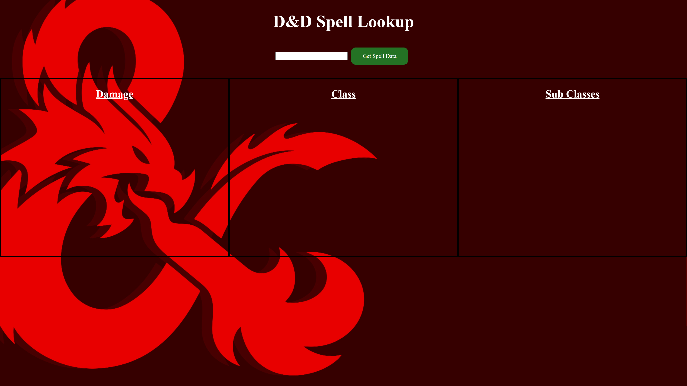

# D&D Damage Spell Lookup
Have you ever been playing a game of D&D and wondered, "Wait how much damage does that spell do again?", "What classes are allowed to use that", "What's the range on that?". Instead of looking like a goober, pull up this handy-dandy D&D spell lookup and get the game back underway!

## How It's Made:

**Tech used:** HTML, CSS, Vanilla JavaScript

This is a simple API web app utilizing the API from https://www.dnd5eapi.co/. This is put together using HTML,CSS, and Vanilla JS to make it snappy and easy to use.

## Lessons Learned:

This was my first time truly jumping headfirst into an API, I used Postman to check the object returned and figured what data I wanted to use. As an avid D&D player I found it pretty cool to create something that I use almost weekly for the games we play. The trickiest part was udnerstanding how to create Lists and impliment those into the dom, then on selecting another spell deleting that current list and updating with new data. I plan on building this out to contain a monster lookup as well as a healing/nuetral spell lookup!
